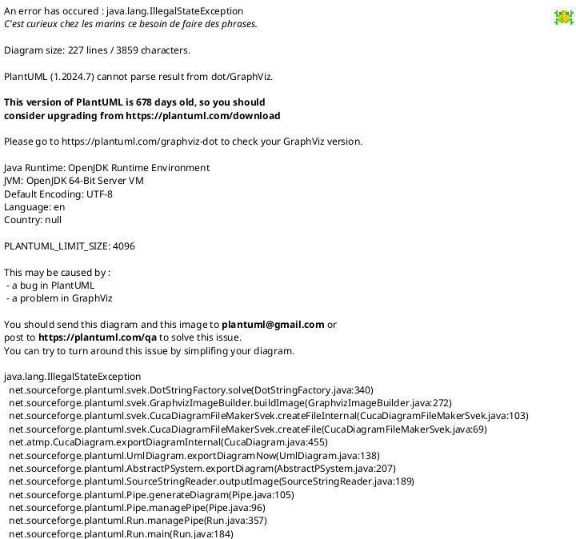

```plantuml
@startuml
!theme plain

skinparam componentStyle uml2
skinparam actorStyle awesome
skinparam packageStyle rect
skinparam linetype ortho
skinparam shadowing false

' ===== Цвета слоёв =====
skinparam package<<voice>> {
  BackgroundColor #E3F2FD
  BorderColor #90CAF9
}

skinparam package<<mode>> {
  BackgroundColor #FFF9C4
  BorderColor #FBC02D
}

skinparam package<<core>> {
  BackgroundColor #E8F5E9
  BorderColor #81C784
}

skinparam package<<hardware>> {
  BackgroundColor #F5F5F5
  BorderColor #BDBDBD
}

skinparam component<<hardware>> {
  FontSize 10
}

' ===== Внешние сущности =====
actor "Пользователь" as User
database "LLM API" as LLM_API

' ===== Основная система =====
package "Роботизированный Голосовой Агент" {

  ' --- Voice ---
  package "Ввод / Вывод (voice)" <<voice>> {
    [ASR\n(Ввод речи)] as ASR
    [TTS\n(Вывод речи)] as TTS

    ASR -right-> TTS : текст
  }

  ' --- Mode ---
  package "LLMMode" <<mode>> {
    [Orchestration\n/ Policy] as Policy
  }

  ' --- Core (СТРОКА) ---
  package "Ядро Агента" <<core>> {
    [SkillExecutor] as Executor
    [RobotTools] as Tools
    [LLMAgent] as Agent

    Tools -right-> Executor
    Executor -right-> Agent
  }

  ' --- Hardware (СТРОКА) ---
  package "Абстракция Оборудования" <<hardware>> {
    component "IRobotDriver" as IDriver <<hardware>>
    component "IKinematics" as IKinematics <<hardware>>
    component "IServo" as IServo <<hardware>>

    IDriver -right-> IKinematics
    IKinematics -right-> IServo
  }
}

' ===== Пользователь =====
User -right-> ASR : говорит
TTS -left-> User : озвучивает

' ===== Voice → Mode =====
ASR -down-> Policy : текст
Policy -down-> TTS : текст

' ===== Mode → Core =====
Policy -down-> Agent : управляет

' ===== Core → API =====
Agent -right-> LLM_API : HTTP

' ===== Core → Hardware =====
Tools -down-> IDriver
Tools -down-> IKinematics
Tools -down-> IServo
@enduml
```